<div align="center">


<h1>Time Frame</h1>

<p><b>A focused time-management system for macOS.</b></p>

<p>
Plan focused work, structure your day, and build routines that hold up over a month —<br>
not just a single twenty-five minute timer.
</p>

<p>
<a href="https://github.com/abarman152/TimeFrame_macOS/releases"></a>
<a href="#install"></a>
<a href="#build-from-source"></a>
<a href="LICENSE"></a>
</p>

<p>
<a href="#install"><b>Install</b></a>
&nbsp;·&nbsp;
<a href="#features"><b>Features</b></a>
&nbsp;·&nbsp;
<a href="#a-month-with-time-frame"><b>Product tour</b></a>
&nbsp;·&nbsp;
<a href="docs/35-MACOS-USER-GUIDE.md"><b>User guide</b></a>
&nbsp;·&nbsp;
<a href="https://github.com/abarman152/TimeFrame_macOS/issues"><b>Report an issue</b></a>
</p>

<br>

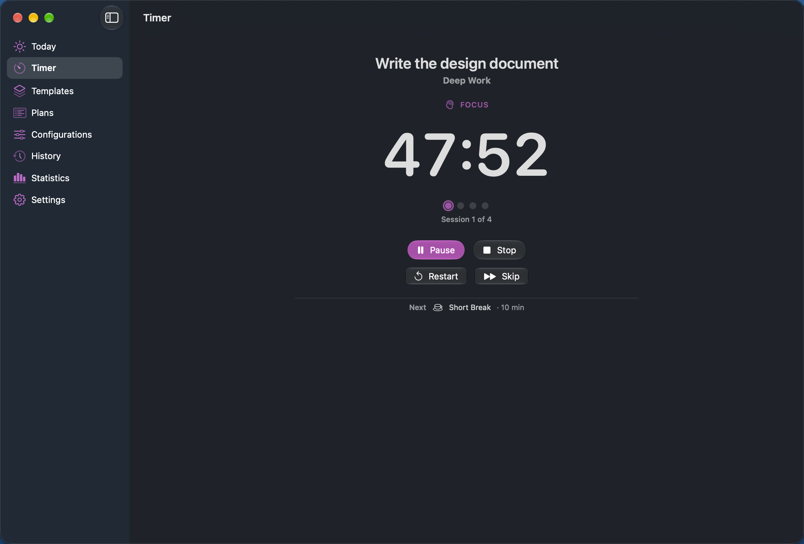

<sub>A focus session in progress. The countdown is derived from real timestamps, never counted down tick by tick.</sub>

</div>

<br>

---

## Install

> **Pre-release.** 1.0 beta 1 is a testing build. It is **not signed with an Apple Developer ID and
> not notarized**, so macOS blocks it on first launch. Step 4 handles that — read it before you
> download.

<table>
<tr>
<td width="33%" valign="top"><b>macOS 27.0 or later</b><br><sub>Earlier versions are not supported.</sub></td>
<td width="33%" valign="top"><b>Apple silicon only</b><br><sub>M1 or later. This build is arm64-only and will not run on an Intel Mac.</sub></td>
<td width="33%" valign="top"><b>About 10 MB installed</b><br><sub>The download is 2.5 MB.</sub></td>
</tr>
</table>

**1. Download** — get the disk image from the
[Releases page](https://github.com/abarman152/TimeFrame_macOS/releases):
[`TimeFrame-1.0.0-beta.1.dmg`](https://github.com/abarman152/TimeFrame_macOS/releases/download/v1.0.0-beta.1/TimeFrame-1.0.0-beta.1.dmg)

**2. Open** — double-click the `.dmg` in your Downloads folder.

**3. Install** — drag **Time Frame** onto the **Applications** shortcut, then eject the disk image.

**4. Allow it to open** — macOS blocks the first launch. Expected for an unnotarized build:

| What macOS says | What to do |
|---|---|
| *"cannot be opened because Apple cannot check it for malicious software"* | Click **Done**, open **System Settings ▸ Privacy & Security**, scroll to **Security**, click **Open Anyway**, confirm, then open the app again. |
| *"is damaged and can't be opened"* | Nothing is corrupted — see below. |

<details>
<summary><b>If macOS says the app is "damaged"</b></summary>

<br>

That message is misleading. It means macOS quarantined the download and the build carries no
Developer ID to check it against. Clear the quarantine flag:

```bash
xattr -d com.apple.quarantine "/Applications/Time Frame.app"
```

Then open Time Frame normally.

Running that command means you are choosing to trust this build yourself, because Apple has not
verified it. Only do it for a download from the
[official Releases page](https://github.com/abarman152/TimeFrame_macOS/releases). Once the project
has a paid Apple Developer membership, builds will be signed and notarized and this step disappears.

On macOS 15 and later, Control-clicking the app and choosing **Open** no longer bypasses Gatekeeper.
Use one of the two routes above.

</details>

**5. Start your first session** — open **Timer**, type what you are focusing on, pick a configuration
(**Classic Pomodoro** is created for you), and click **Start**. Notifications and Calendar are
optional and only ask for access when you turn them on in Settings.

<details>
<summary><b>Known limits of this pre-release</b></summary>

<br>

| Limit | Detail |
|---|---|
| **The widget shows no live data** | App Group containers are keyed by Apple team identifier, and an ad-hoc signature has none, so macOS denies the container the widget reads. Everything inside the app — timer, menu bar, notifications, calendar, history, statistics — is unaffected. Only a signed build fixes this. |
| **Apple silicon only** | The binary is arm64-only. On an Intel Mac, [build from source](#build-from-source). |
| **iCloud sync is off** | It has never been enabled or verified. Your data stays on this Mac. |

To update later, download the newer `.dmg` and replace the app in Applications. Your library lives in
the app's own container and is not touched.

</details>

Prefer to compile it yourself? See [Build from source](#build-from-source).

---

## Features

<table>
<tr>
<td width="33%" valign="top">
<b>Flexible Pomodoro</b><br>
<sub>Focus from 1 minute to 8 hours, breaks from 0 to 8, up to 24 sessions in a run, long break every 1–12 sessions. Nothing forces your work into 25 and 5.</sub>
</td>
<td width="33%" valign="top">
<b>Templates</b><br>
<sub>Save a complete focus setup — task, configuration, session count, icon — and start it again tomorrow without rebuilding it.</sub>
</td>
<td width="33%" valign="top">
<b>Plans</b><br>
<sub>An ordered timeline for work that is not a uniform repetition, where each focus interval may use a different configuration.</sub>
</td>
</tr>
<tr>
<td valign="top">
<b>Quick Start</b><br>
<sub>Pin the templates and plans you use most. They appear in the menu bar and the Timer header, from one shared pinned list.</sub>
</td>
<td valign="top">
<b>Calendar integration</b><br>
<sub>Write plans and live sessions into a calendar you choose, so focused work sits beside the commitments you already made.</sub>
</td>
<td valign="top">
<b>History and statistics</b><br>
<sub>Every session recorded with the configuration name frozen as it ran. Metrics and charts over a day, week, month or custom range.</sub>
</td>
</tr>
<tr>
<td valign="top">
<b>Menu bar control</b><br>
<sub>Phase, countdown, session position and the four transport controls, plus Quick Start — without opening the window.</sub>
</td>
<td valign="top">
<b>System integration</b><br>
<sub>Notifications on the transitions you choose, a configurable widget, App Shortcuts for Siri and automation, and Open at Login.</sub>
</td>
<td valign="top">
<b>Local and private</b><br>
<sub>No account, no analytics, no network service. Light and Dark Mode, VoiceOver labels, Dynamic Type and Reduce Motion throughout.</sub>
</td>
</tr>
</table>

---

## A month with Time Frame

<div align="center">
<sub><b>CONFIGURE</b> &nbsp;→&nbsp; <b>REUSE</b> &nbsp;→&nbsp; <b>ORGANIZE</b> &nbsp;→&nbsp; <b>FOCUS</b> &nbsp;→&nbsp; <b>REVIEW</b> &nbsp;→&nbsp; <b>REFINE</b></sub>
</div>

<br>

### Week 1 — Configure

Describe how you actually work. A configuration holds focus length, both break lengths, the session
count and the long-break cadence. One is the default new sessions start from.

<table>
<tr>
<td width="50%" valign="top">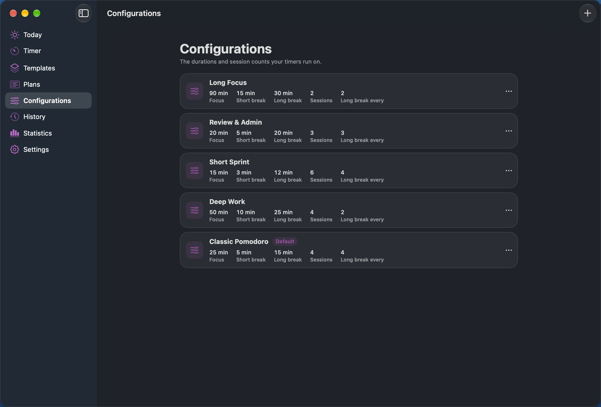</td>
<td width="50%" valign="top">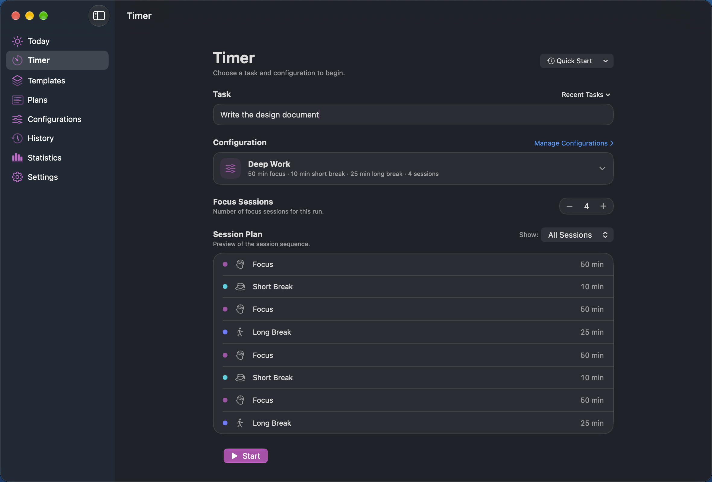</td>
</tr>
<tr>
<td valign="top"><sub>Short Sprint for shallow work, Deep Work for mornings, Long Focus for a day given to one thing.</sub></td>
<td valign="top"><sub>Name the task, choose the structure, and see the exact interval sequence before committing.</sub></td>
</tr>
</table>

### Week 2 — Reuse and organize

The same setups keep coming back. Save them as **Templates** and stop rebuilding them.

<table>
<tr>
<td width="50%" valign="top">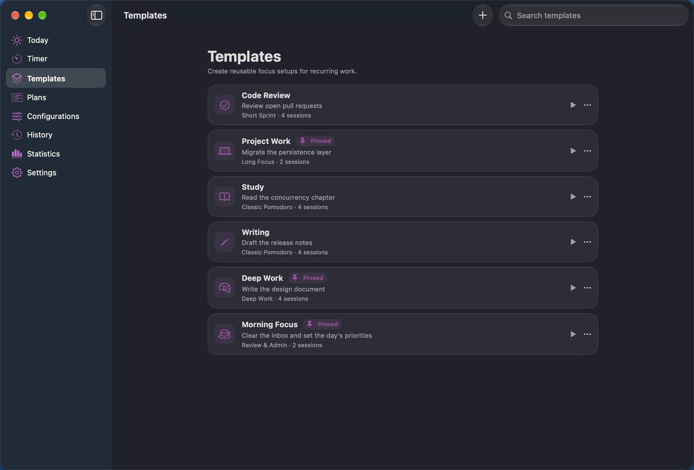</td>
<td width="50%" valign="top">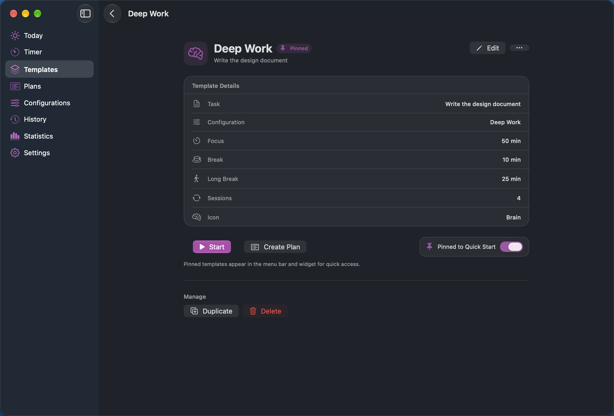</td>
</tr>
<tr>
<td valign="top"><sub>Six reusable workflows, each with its own icon and pin state.</sub></td>
<td valign="top"><sub>A template references its configuration rather than copying it. Editing or deleting it later never disturbs a running session or your history.</sub></td>
</tr>
</table>

Some work does not repeat uniformly. A release week is a long stretch of deep work, then a shorter
pass over the release notes, then twenty minutes of review — three rhythms in one sitting. That is a
**Plan**.

<div align="center">
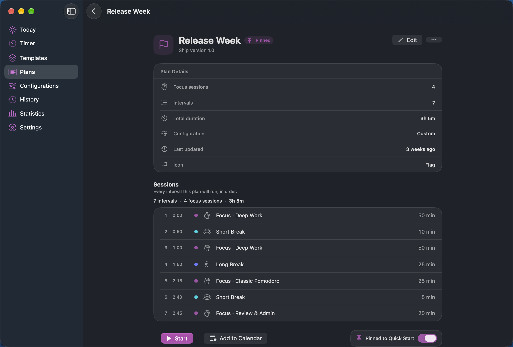

<sub>Seven intervals, three different configurations, one timeline — and a single action to put it in Apple Calendar.</sub>
</div>

Starting a plan freezes it into an immutable snapshot and runs that, so editing the plan afterwards
cannot change a session already running or already recorded.

### Week 3 — Focus

Once the plan is ready, Time Frame gets out of the way. Because timing is anchored to real
timestamps, interruptions are ordinary rather than special: pause and the remaining time freezes
exactly; quit and relaunch and the session is reconciled against the real timeline, to the second.

<table>
<tr>
<td width="62%" valign="top">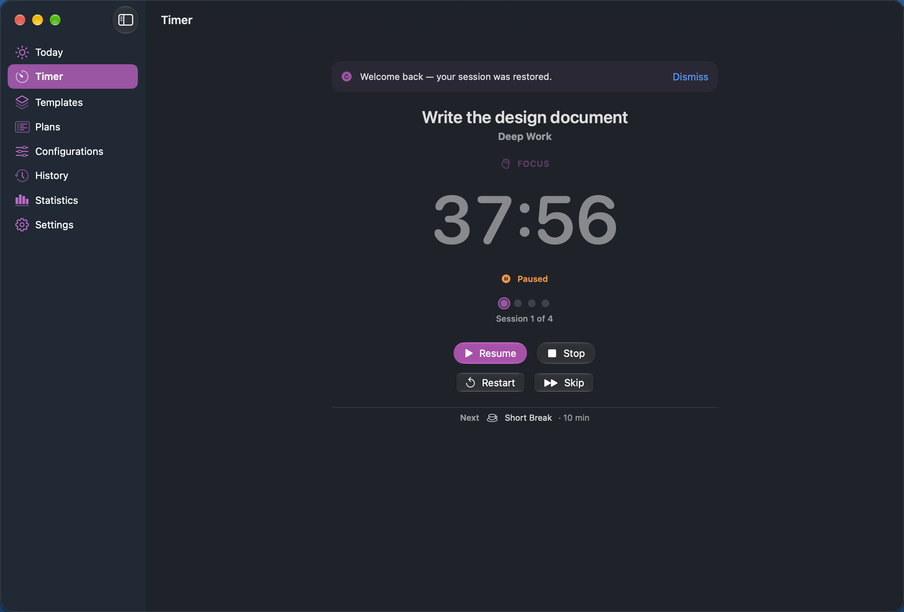</td>
<td width="38%" valign="top">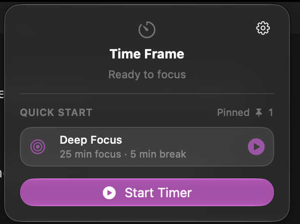</td>
</tr>
<tr>
<td valign="top"><sub>Quit mid-session and come back: the app says so, and the clock has not drifted.</sub></td>
<td valign="top"><sub>The menu bar carries the same session, the same controls and your pinned workflows. Nothing in the popover scrolls.</sub></td>
</tr>
</table>

### Week 4 — Review and refine

Completed sessions become the record of what the month actually looked like.

<table>
<tr>
<td width="50%" valign="top">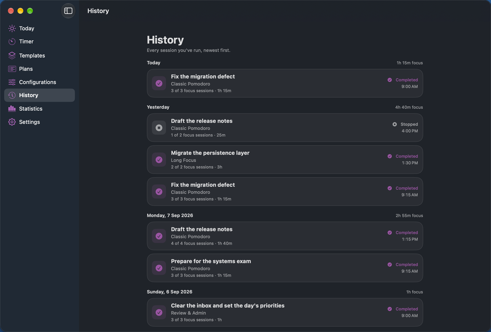</td>
<td width="50%" valign="top">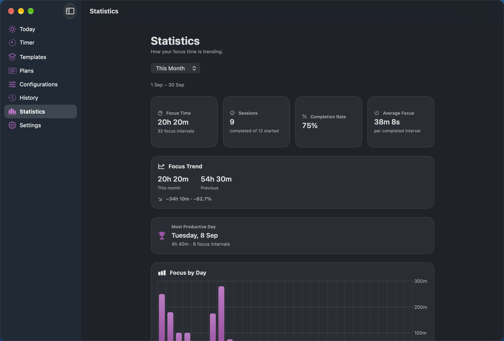</td>
</tr>
<tr>
<td valign="top"><sub>Read-only, grouped by day, with the configuration name frozen as it ran. Renaming a configuration never rewrites history.</sub></td>
<td valign="top"><sub>Focus time, completion rate, the trend against the previous period, and your most productive day.</sub></td>
</tr>
</table>

Time Frame makes no claim about what focusing will do for you. It tells you what happened — so you
can change the configurations, templates and plans that did not survive contact with a real week, and
start the next month from something better.

<details>
<summary><b>More screens</b></summary>

<br>

<table>
<tr>
<td width="50%" valign="top">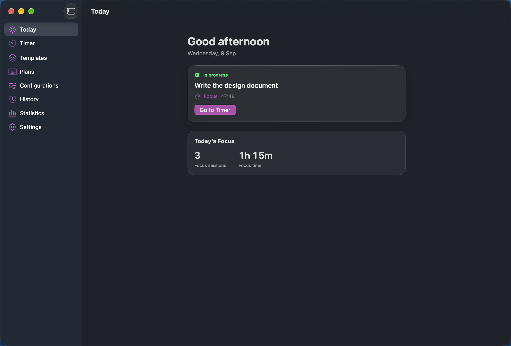<br><sub><b>Today</b> — what is running now, and what the day has amounted to.</sub></td>
<td width="50%" valign="top">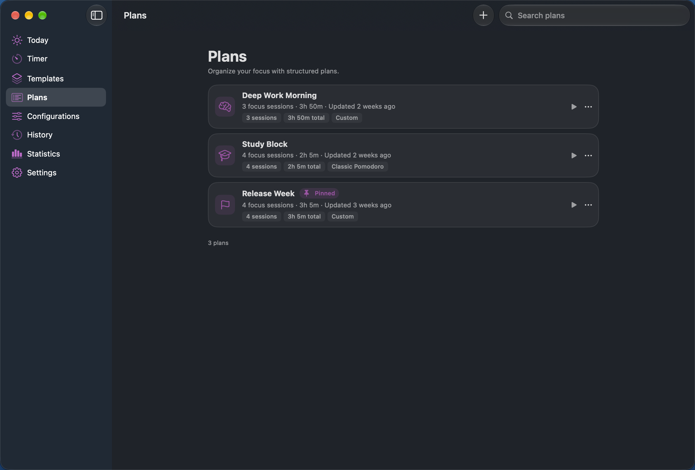<br><sub><b>Plans</b> — session count, total duration, and "Custom" where a plan mixes configurations.</sub></td>
</tr>
<tr>
<td valign="top">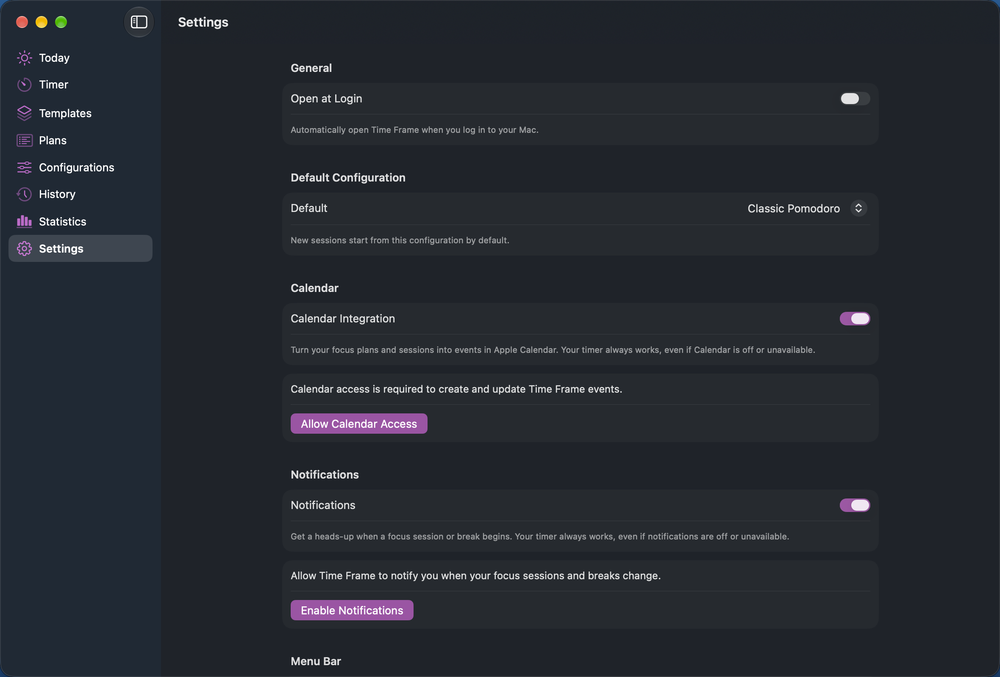<br><sub><b>Settings</b> — Open at Login, default configuration, Calendar, Notifications, menu bar, iCloud status.</sub></td>
<td valign="top">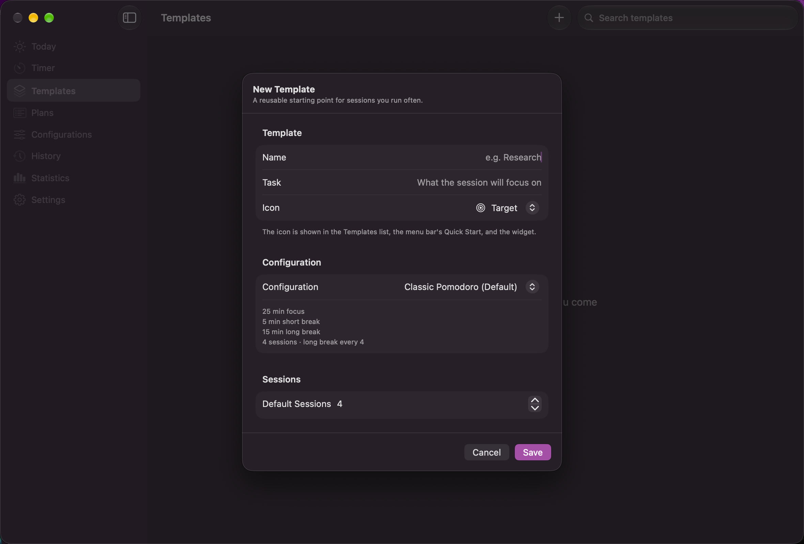<br><sub><b>Template editor</b> — the icon picker and configuration summary.</sub></td>
</tr>
</table>

Every image is a real capture of the running application. See the
[screenshot inventory](docs/assets/screenshots/macos/README.md) for the capture environment and
sample data.

</details>

---

## How it fits together

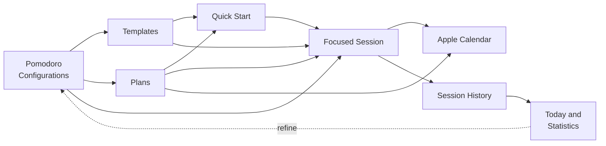

Configurations describe your working rhythms. Templates and Plans build reusable workflows on top of
them. Quick Start puts the ones you use most one click away. A focused session runs through the same
engine whatever started it, records itself in History, and feeds the statistics you use to refine the
next round.

---

## Reference

<table>
<tr>
<td width="50%" valign="top">

**The eight areas**

| Area | For |
|---|---|
| **Today** | The day at a glance |
| **Timer** | Setup, then countdown and controls |
| **Templates** | Reusable focus setups |
| **Plans** | Ordered, mixed-configuration timelines |
| **Configurations** | The durations timers run on |
| **History** | Every session, read-only |
| **Statistics** | Metrics, trends and charts |
| **Settings** | Integrations and preferences |

</td>
<td width="50%" valign="top">

**Keyboard**

| Key | Action |
|---|---|
| `⌘↩` | Start session |
| `Space` | Pause / Resume |
| `Esc` | Stop session |
| `R` | Restart interval |
| `→` | Skip interval |
| `⌘N` | New item on this screen |
| `⌘E` | Edit template or plan |

</td>
</tr>
</table>

<details>
<summary><b>System integration in detail</b></summary>

<br>

| Surface | What it does |
|---|---|
| **Menu bar** | Phase, countdown, paused state, focus progress, session position, next interval, and the four transport controls. Quick Start below them, secondary actions behind a gear menu, and an optional live countdown in the status item. |
| **Widget** | Small and medium, on the desktop or in Notification Centre. Configurable between a Timer, Today or Statistics view, with a chosen tap destination and interactive controls in Timer mode. |
| **Notifications** | Focus start, short break start, long break start and session completion, each independently switchable, with optional sound and action buttons. |
| **Calendar** | Add a plan's intervals to a calendar you choose, update them afterwards, and optionally reflect a live session as a single event. |
| **App Shortcuts** | Start Time Frame, Start Template, Start Plan, Pause, Resume, Skip, Stop, Check Status, Open Time Frame. |
| **Open at Login** | Registered through `SMAppService`. The switch reflects what macOS actually holds, never a stored preference. |
| **Single window** | Every entry point — Dock, menu bar, deep link — focuses the one existing window rather than opening a second. |

**Session control.** Pause, Resume, Skip, Restart and Stop are available from the app, the menu bar,
the widget, a notification action, or Siri. A session running when the app last quit is reconciled
against the real timeline on the next launch.

</details>

<details>
<summary><b>Accessibility and appearance</b></summary>

<br>

- VoiceOver labels and values on the countdown, phase, controls and statistics, with the countdown
  marked as frequently updating so it does not interrupt continuously.
- Every menu bar control names what it acts on, and a disabled control explains itself in words
  rather than by dimming alone.
- Dynamic Type throughout, with the Timer screen scrolling rather than clipping at accessibility
  sizes.
- State is never carried by colour alone; animation respects Reduce Motion.
- One design in both Light and Dark Mode, taking its accent from the system.

Verified from source and by automated accessibility-text tests. **Not** validated with VoiceOver on
physical hardware.

</details>

---

## Architecture

Dependencies point downward only. `TimerEngine` imports neither SwiftUI nor SwiftData and reads time
through an injected clock, which makes the whole timing model deterministically testable.

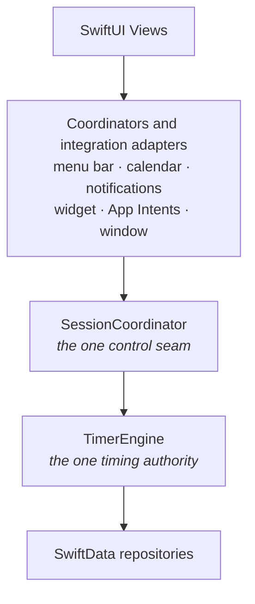

Four invariants hold the design together, and each is enforced by an automated source audit that
fails the build if it regresses.

| Invariant | Meaning |
|---|---|
| **One engine** | Exactly one `TimerEngine` and one `SessionCoordinator` per running application. |
| **Timestamp-authoritative** | A running interval is anchored to a target end date; remaining time is always `targetEnd - now`. Nothing decrements a counter. |
| **One mutation seam** | Every command, from every surface, converges on `SessionCoordinator`. |
| **Bounded control path** | Lifecycle events are emitted synchronously, so observers may only do work derived from in-memory anchors. Anything that reads the store is deferred and coalesced. |

<details>
<summary><b>Widget and command architecture</b></summary>

<br>

The widget extension runs in a separate process and cannot read the application's database. The
bridge is a single small `Codable` value:

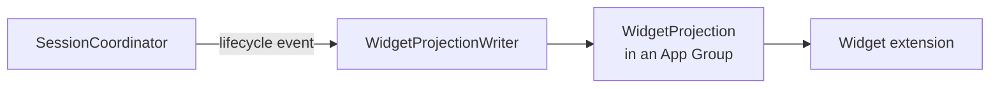

The projection carries the interval's frozen start and end anchors, so the widget renders its
countdown with `Text(timerInterval:)` between them — a repaint, not a clock. It is written only on
meaningful transitions, never per tick.

Every command from every surface converges on one seam:

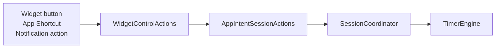

WidgetKit runs a widget-button intent in the application's own process, where the router is
registered. Failures surface as a closed error set, never a leaked framework error.

</details>

<details>
<summary><b>Persistence and data safety</b></summary>

<br>

SwiftData with a versioned schema, currently **V7**, and a migration plan. Repositories are the only
types that touch a `ModelContext`. Historical identity is frozen: a session copies the values it
needs when it starts, including the configuration's name, so renaming or deleting a configuration
never rewrites history.

**A store that cannot be opened is preserved, never deleted.** If the store cannot be opened — an
unrecognised schema, a damaged file, a permissions problem, a lock held by another copy — Time Frame
leaves every byte where it is, shows a recovery screen instead of an empty library, and waits for you
to choose: try again, reveal the store in Finder, or move it into a dated `TimeFrame Recovery` folder
and start fresh. There is no `FileManager.removeItem` anywhere in production source.

See [Data Safety and Recovery](docs/40-M31-DATA-SAFETY-AND-RECOVERY.md).

</details>

<details>
<summary><b>Isolated integrations and the design system</b></summary>

<br>

**Calendar.** `EventKitCalendarService` is the only file in the codebase that imports EventKit;
`TimerEngine` and the domain import none of it. A `CalendarCoordinator` subscribes to the same pure
`SessionLifecycleEvent` seam that notifications and the widget projection use, so the three
integrations are independent. Calendar work is deferred off the timer's control path, and a Calendar
failure can never stop, delay or corrupt a running timer — an isolation property covered by its own
tests.

**Notifications.** Isolated behind a protocol, with `UserNotificationService` as the only file
importing UserNotifications. Notifications are scheduled from the engine's frozen interval-end
anchors — one per boundary, never on a tick — with deterministic identifiers so reconciliation is
idempotent. Every failure is caught.

**Design system.** `Core/Support/DesignSystem/` owns the spacing and radius scales, the type scale,
the control-size rule, the semantic palette, the Reduce-Motion-aware animation vocabulary, the glass
surfaces, and the one content card every grouped surface uses. It imports none of the domain, and no
file under `Core/Timer/`, `Core/Models/` or `Core/Services/` changes for a visual reason. Each page
has exactly one prominent action, sized to its content at the native control height.

</details>

<details>
<summary><b>iCloud status</b></summary>

<br>

> **iCloud synchronization is disabled.** This project is developed with a personal (free) Apple
> Developer team, which cannot provision the iCloud capability. The entitlement is deliberately
> absent, no CloudKit container is used, and `CloudKitCapability.entitledInThisBuild` is `false`, so
> the application launches local-first. A test fails the build if the entitlement and that constant
> ever disagree.
>
> Cross-device synchronization has **never been enabled or verified**, and Time Frame does not claim
> working sync.

No file in the codebase imports CloudKit. Sync, when eventually enabled, is SwiftData's native
mirroring beneath the repositories.

</details>

---

## Build from source

Building it yourself takes a few minutes, produces a build signed for your own machine, and — with a
real team — is the only way to get the widget working, since the App Group container needs a team
identifier.

```bash
xcodebuild -project time_frame.xcodeproj -scheme time_frame \
  -destination 'platform=macOS' build
```

| Requirement | Version |
|---|---|
| Xcode | 27.0 |
| Swift | 6.4 toolchain, Swift 5 language mode |
| Apple account | Any Apple ID. A paid membership is **not** required to build and run |

<details>
<summary><b>Setup, signing, and the two identifiers you must change</b></summary>

<br>

1. Open `time_frame.xcodeproj` in Xcode 27.
2. Change the bundle identifier and App Group — see the table below. Signing fails until you do.
3. Set your team under Signing & Capabilities for the `time_frame` and `TimeFrameWidgets` targets.
4. Choose the `time_frame` scheme and **My Mac** as the destination, then build and run.

The identifiers in this repository are registered to the original author's team:

| What | Current value | Where |
|---|---|---|
| Bundle identifier | `abirbarman.com.time-frame` | Signing & Capabilities, both targets |
| App Group | `group.abirbarman.com.time-frame` | Two `.entitlements` files, plus `Shared/WidgetProjectionStore.swift` |

The App Group string is repeated across the two entitlements files, one Swift constant, and a handful
of test assertions that check the literal value, so changing it means a find-and-replace across all
of them. Consolidating it into a single configurable value is outstanding work.

**Building without signing.** Useful for CI, and required if you have not set a team:

```bash
xcodebuild -project time_frame.xcodeproj -scheme time_frame \
  -destination 'platform=macOS' CODE_SIGNING_ALLOWED=NO build
```

This strips entitlements, which disables the sandbox and the App Group. Run `xcodebuild` invocations
serially; concurrent runs contend on the shared DerivedData build database.

**Developing against a scratch store.** The application declares the App Sandbox, so a *signed* build
keeps its data in its own container. A build made with `CODE_SIGNING_ALLOWED=NO` has its entitlements
stripped, is therefore **not** sandboxed, and falls back to the shared unsandboxed path — the same
store an installed copy would use. Redirect any build with an environment variable on the scheme's
Run action:

```bash
TIMEFRAME_STORE_DIRECTORY=/tmp/timeframe-dev
```

Do this before running an unsigned build against a library you care about. The test suite always uses
an isolated store under the temporary directory, enforced by a test that checks the live environment.
The bundle identifier is deliberately unchanged, so a development build still shares `UserDefaults` —
settings and permissions — with an installed copy; only the store is isolated.

**Why the release build is not notarized.** A personal (free) Apple Developer team cannot issue a
Developer ID certificate, so notarization and Mac App Store distribution are both unavailable.
Building and running it yourself needs no paid membership.

</details>

---

## Testing

```bash
xcodebuild -project time_frame.xcodeproj -scheme time_frame \
  -destination 'platform=macOS' test
```

<table>
<tr>
<td width="33%" align="center"><h3>1020</h3><sub>tests in 218 suites, all passing</sub></td>
<td width="33%" align="center"><h3>0</h3><sub>warnings, Debug build</sub></td>
<td width="33%" align="center"><h3>0</h3><sub>warnings, Release build</sub></td>
</tr>
</table>

<sub>Measured 2026-09-09 on macOS 27 with Xcode 27. There is no continuous integration; these numbers were measured locally.</sub>

<details>
<summary><b>What the suites cover</b></summary>

<br>

- **Deterministic domain tests** driven by an injected mock clock. The timer suite never waits a real
  second.
- **Persistence and integration tests** over in-memory and on-disk stores, including an executed
  V6 → V7 migration against a store written by the previous schema rather than an assumed one.
- **Isolation tests** proving that a failing Calendar, notification or widget integration cannot stop
  or corrupt a session.
- **Source-boundary audits** that scan the tree and fail the build if an architectural invariant
  regresses — a second timer engine, a second scheduling primitive, SwiftData inside the widget
  extension, a CloudKit import, or an unannounced schema change.

</details>

---

## Privacy

Time Frame stores your configurations, templates, plans and session history locally on your Mac.
There is no account, no analytics, no tracking, and no network service your data is sent to. The
application works entirely offline.

| Claim | Status |
|---|---|
| Makes no network requests, no server component | Verified |
| No credentials or signing material committed to this repository | Verified by an automated audit |
| No iCloud entitlement declared, no CloudKit container contacted | Verified |
| Data in the app's own sandbox container, standard OS file protection | Verified |
| Application-level encryption | **Not claimed.** Time Frame adds no encryption layer of its own |

The widget reads a small shared summary — current phase, interval anchors, today's totals — from an
App Group container. Notifications are scheduled locally. Calendar events are written only to a
calendar you choose, and only when you turn the integration on. See the
[privacy nutrition labels](docs/appstore/PRIVACY-NUTRITION-LABELS.md).

---

## Project status

**Current release: 1.0 beta 1**, a macOS pre-release published on
[GitHub Releases](https://github.com/abarman152/TimeFrame_macOS/releases). The feature set is
complete; the build is out for testing before a stable 1.0. Please report what you find through
[Issues](https://github.com/abarman152/TimeFrame_macOS/issues) — macOS version, what you did, what
you expected, what happened.

This repository contains the **macOS application**, which is the released product. An iPhone and iPad
companion exists as separate native targets built from the same platform-neutral core, but it is
**not part of this repository and is not a released product**.

<table>
<tr>
<td width="50%" valign="top">

**Known limitations**

- The pre-release is ad-hoc signed and not notarized: macOS blocks it on first open, and the widget
  receives no data.
- The binary is arm64-only and will not run on an Intel Mac.
- iCloud sync is disabled and has never been verified.
- Live Activities and Control Center controls are unavailable on macOS by platform constraint.
- VoiceOver validated from source and tests, not on hardware.
- No continuous integration.

</td>
<td width="50%" valign="top">

**Deferred work**

- Sign and notarize with a Developer ID, removing the Gatekeeper step and restoring widget data.
- Ship a universal binary so the release runs on Intel Macs.
- Enable and verify CloudKit synchronization.
- Consolidate the App Group identifier into one configurable value.
- Project template and plan icons into the widget.

</td>
</tr>
</table>

---

## Documentation

<table>
<tr>
<td width="50%" valign="top">

**Using it**

| | |
|---|---|
| [User Guide](docs/35-MACOS-USER-GUIDE.md) | Every screen, shortcuts, FAQ |
| [Screenshot inventory](docs/assets/screenshots/macos/README.md) | Capture environment and data |
| [Changelog](docs/CHANGELOG.md) | Milestone by milestone |
| [Documentation index](docs/README.md) | Everything, organised |

</td>
<td width="50%" valign="top">

**Working on it**

| | |
|---|---|
| [Developer Overview](docs/36-DEVELOPER-OVERVIEW.md) | Orientation and invariants |
| [Architecture](docs/01-ARCHITECTURE.md) | The full architecture |
| [Data Model](docs/02-DATA-MODEL.md) | Models and schema V7 |
| [Timer Engine](docs/03-TIMER-ENGINE.md) | The state machine |
| [Decisions](docs/DECISIONS.md) | Every ADR |

</td>
</tr>
</table>

<details>
<summary><b>Subsystem documents and the decisions that constrain the code</b></summary>

<br>

| Document | For |
|---|---|
| [Session Planner](docs/14-SESSION-PLANNER.md) | Plans, snapshots and execution |
| [Calendar Integration](docs/15-CALENDAR-INTEGRATION.md) | The EventKit isolation and event model |
| [Notifications](docs/16-NOTIFICATIONS.md) | Scheduling from frozen anchors |
| [Statistics](docs/19-STATISTICS.md) | The read-only aggregation layer |
| [WidgetKit](docs/20-WIDGETKIT.md) | Widget projection and App Group |
| [Menu Bar, Quick Start and Icons](docs/37-M28-MENU-BAR-QUICK-START-ICONS.md) | Popover hierarchy, pinning, icon catalog |
| [Data Safety and Recovery](docs/40-M31-DATA-SAFETY-AND-RECOVERY.md) | Why an unopenable store is preserved |
| [Stability and Reliability](docs/34-M26-STABILITY-AND-RELIABILITY.md) | The freeze investigation and its rules |

| ADR | Decision |
|---|---|
| ADR-045 / ADR-049 | The menu bar is a control surface over the one coordinator, never a second timer |
| ADR-055 | Widget surfaces are a read-only projection; the extension imports no SwiftData |
| ADR-056 | Every App Intent acts only through the one `AppIntentSessionActions` seam |
| ADR-099 / ADR-100 | Nothing on the timer control path may do unbounded or persistence-heavy work |
| ADR-101 | A `MenuBarExtra` label must never contain a `TimelineView` |
| ADR-103 | Icons are a closed catalog; the persisted value is a stable identifier |
| ADR-104 | Pin state lives on the pinned item, keyed by its identifier |
| ADR-107 | The menu bar popover does not scroll |
| ADR-109 | A store that cannot be opened is preserved, never deleted |
| ADR-111 | There is one main window and one pathway to it |
| ADR-112 | The login item is registered with `SMAppService`; the system is the source of truth |

</details>

---

## Troubleshooting

<details>
<summary><b>macOS will not open the downloaded app</b></summary>

<br>

Expected for this pre-release — it is not notarized. See [Install, step 4](#install).

</details>

<details>
<summary><b>Time Frame will not launch, or reports a bad CPU type</b></summary>

<br>

The 1.0 beta 1 binary is arm64-only and needs an Apple silicon Mac. On an Intel Mac,
[build from source](#build-from-source).

</details>

<details>
<summary><b>The widget shows placeholder data or nothing at all</b></summary>

<br>

The pre-release is ad-hoc signed with no Apple team identifier, so macOS denies it the App Group
container the widget reads. Build with your own signing team to get live widget data. The app itself
is unaffected.

</details>

<details>
<summary><b>The menu bar item is missing</b></summary>

<br>

Settings has a **Show in Menu Bar** preference. Toggling it never affects a running session.

</details>

<details>
<summary><b>A template or plan says it needs a configuration</b></summary>

<br>

Its configuration was deleted. Open the item, choose a configuration, and save — the item itself was
never lost.

</details>

<details>
<summary><b>Time Frame quit when I closed the window, or the Dock icon does not restore it</b></summary>

<br>

Closing the window leaves the app running in the menu bar, and a running session keeps running. If
Time Frame is not in your menu bar, check Settings ▸ Menu Bar — with the menu bar hidden and the
window closed, the Dock icon is the only way back.

If Time Frame is running with no window, a Dock click creates one. If the window is minimized or the
app is hidden, the same click restores and focuses the existing one. Either way you get exactly one
window; the app cannot open a second.

</details>

<details>
<summary><b>Open at Login is off even though I turned it on</b></summary>

<br>

The switch reflects what macOS actually holds, not what you asked for. Either the registration was
refused — the reason is shown under the toggle — or macOS is waiting for you to approve the item, in
which case Time Frame offers **Open Login Items Settings**.

</details>

<details>
<summary><b>History or Statistics look wrong after editing a configuration</b></summary>

<br>

They should not change. Each session freezes its own plan and configuration name when it starts.

</details>

<details>
<summary><b>A build fails with a code-signing error</b></summary>

<br>

Set your own team in Signing & Capabilities, or add `CODE_SIGNING_ALLOWED=NO` to a command-line
build.

</details>

---

## Contributing

This is a personal project with no formal contribution process. If you are working in this codebase,
read [`CLAUDE.md`](CLAUDE.md) for the operating rules and [`docs/DECISIONS.md`](docs/DECISIONS.md)
before changing anything structural. Bug reports and feedback on the pre-release are welcome through
[Issues](https://github.com/abarman152/TimeFrame_macOS/issues).

---

## License

Released under the **MIT License** — see [LICENSE](LICENSE). You may use, copy, modify, merge,
publish, distribute, sublicense and sell this software, for any purpose including commercial, free of
charge, provided the copyright notice and permission notice travel with it.

The software is provided as is, without warranty. That clause is not decoration: this is a personal
project that has never been notarized, and it manages data you may care about.

MIT licenses the **code**. It does not grant rights to the product name "Time Frame" or to the app
icon. If you distribute a modified build, change the name and the icon so users can tell your version
from this one.

<div align="center">
<br>
<sub>Built with SwiftUI, SwiftData and Swift Testing. No third-party dependencies.</sub>
</div>
