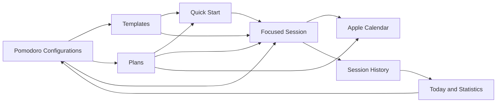

<div align="center">


# Time Frame

**A focused time-management system for macOS.**

[](#requirements)
[](#requirements)
[](#architecture)
[](#project-status)
[](LICENSE)

</div>

Time Frame is a native macOS application for planning focused work, structuring your day, and
building productivity habits that hold up over weeks rather than minutes. It runs Pomodoro-style
focus sessions — but the timer is the smallest part of it. Around that timer sit the things that
make focused work repeatable: your own interval structures, saved workflows you can start in one
click, ordered plans for work that is not a uniform repetition, your calendar, and a history that
tells you what actually happened.

<div align="center">
  
</div>

---

## Contents

- [Why Time Frame](#why-time-frame)
- [A month with Time Frame](#a-month-with-time-frame)
- [How it fits together](#how-it-fits-together)
- [Feature reference](#feature-reference)
- [Requirements](#requirements)
- [Installation](#installation)
- [Testing](#testing)
- [Architecture](#architecture)
- [Privacy](#privacy)
- [Project status](#project-status)
- [Documentation](#documentation)
- [License](#license)

---

## Why Time Frame

### Focus structures that match how you actually work

A Pomodoro configuration in Time Frame is a full description of a working rhythm: focus length,
short break, long break, how many focus sessions, and how often a long break falls. Focus
intervals run from 1 minute to 8 hours, breaks from 0 minutes to 8 hours, up to 24 focus sessions
in a run, with a long break every 1 to 12 sessions. Nothing forces your work into 25 and 5.

### Templates

Save a complete focus setup — the task, the configuration, the number of sessions, an icon — and
start it again tomorrow without rebuilding anything.

### Plans

For work that is not a uniform repetition: an explicit, ordered timeline of focus intervals and
breaks, where each focus interval may use a **different** configuration.

### Quick Start

Pin the templates and plans you reach for most. They appear in the menu bar and in the Timer
screen's header, ready to start in one click, from the same pinned list in both places.

### Calendar integration

Turn a plan, or a live session, into events in Apple Calendar, so focused work sits on the same
calendar as everything else you have committed to.

### Session history and statistics

Every session you run is recorded with the configuration name it ran under, frozen at the moment
it started. Statistics re-derive from that history over a day, a week, a month, or a range you
choose.

### A menu bar that is a control surface, not a second app

Pause, resume, skip, restart, stop, and start a pinned workflow without leaving what you are
doing.

### Native, local, and private

SwiftUI and SwiftData throughout. No account, no analytics, no network service. Light and Dark
Mode, VoiceOver labels, Dynamic Type, and Reduce Motion support are part of the design system,
not an afterthought.

---

## A month with Time Frame

Time Frame is built for the long arc of focused work, not for a single 25-minute timer. Here is
how the pieces come together over a working month.

### Week 1 — Configure

Start by describing how you actually work. A configuration holds the focus length, both break
lengths, the number of focus sessions, and the long-break cadence, and one of them is the default
that new sessions begin from.

<div align="center">
  
</div>

Short Sprint for shallow work, Deep Work for the mornings, Long Focus for a day given over to one
thing. Build the structures your week needs; the rest of the application refers to them by name.

Then set up a run on the Timer screen. You name the task, choose the configuration, choose how
many focus sessions, and see the exact interval sequence before you commit to it.

<div align="center">
  
</div>

### Week 2 — Reuse and organize

By the second week the same setups keep coming back. Save them as **Templates** and stop
rebuilding them.

<div align="center">
  
</div>

A template references its configuration rather than copying it, and starting from a template
copies its values into the ordinary setup path — so a running session is independent of the
template, and editing or deleting the template later never disturbs a session or your history.

<div align="center">
  
</div>

Some work does not repeat uniformly. A release week is a long stretch of deep work, then a
shorter pass over the release notes, then twenty minutes of review — three different rhythms in
one sitting. That is a **Plan**: an ordered timeline where each focus interval may run on a
different configuration.

<div align="center">
  
</div>

From here you can add the plan's intervals to Apple Calendar, so the focused work you intend to do
appears alongside the meetings you have already agreed to. Starting a plan freezes it into an
immutable snapshot and runs that, so editing the plan afterwards cannot change a session that is
already running or already recorded.

### Week 3 — Focus

Once the plan is ready, Time Frame gets out of the way. The screen becomes the countdown, the
phase, where you are in the session, what comes next, and the controls — nothing else. That is the
screen at the top of this page.

The countdown is derived from real timestamps rather than counted down tick by tick, which is why
interruptions are ordinary rather than special. Pause and the remaining time freezes exactly.
Close the window, quit the app, sleep the Mac — the session is reconciled against the real
timeline when you come back, down to the second.

<div align="center">
  
</div>

You do not have to keep the window open to stay in control. The menu bar carries the same session
and the same controls, plus your pinned Quick Start items.

<div align="center">
  
</div>

Nothing in the popover scrolls: it is a glance-and-go surface, so the transport controls can never
be pushed off screen however many items you pin. Notifications mark the transitions you asked to
be told about, and a widget — on your desktop or in Notification Centre — shows the running
session, today's focus, or a statistics glance, with the same controls in Timer mode.

Today keeps the same information one click away inside the app: what is running now, and what the
day has amounted to so far.

<div align="center">
  
</div>

### Week 4 — Review and refine

Completed sessions become the record of what the month actually looked like. History lists every
session, newest first, grouped by day, with each day heading stating that day's completed focus
time.

<div align="center">
  
</div>

History is strictly read-only, and each row keeps the configuration name it ran under. Rename or
delete a configuration later and your history stays accurate.

Statistics turns the same history into a picture of the month: total focus time, sessions
completed of sessions started, completion rate, average focus per interval, the trend against the
previous period, your most productive day, and focus by day and by configuration.

<div align="center">
  
</div>

Time Frame does not tell you what any of this means, and it makes no claim about what focusing
will do for you. It tells you what happened — so you can go back to the configurations, templates
and plans you built in weeks one and two, change the ones that did not survive contact with a real
week, and start the next month from something better.

That loop is the product: **plan, configure, focus, track, refine, repeat.**

---

## How it fits together



Configurations describe your working rhythms. Templates and Plans build reusable workflows on top
of them. Quick Start puts the ones you use most one click away. A focused session runs through the
same engine whatever started it, records itself in History, and feeds the statistics you use to
refine the next round.

---

## Feature reference

The macOS application is a sidebar split view with eight areas.

| Area | What it is for |
|---|---|
| **Today** | The current day at a glance: the session in progress, and today's completed focus sessions and focus time |
| **Timer** | The only place a session is started from the app. Setup when idle, the countdown and controls when running |
| **Templates** | Reusable focus setups: a name, a task, a configuration, a default session count, an icon |
| **Plans** | Explicit ordered timelines of focus intervals and breaks, mixing configurations where you want to |
| **Configurations** | The durations your timers run on, with one marked as the default |
| **History** | Every session you have run, grouped by day, read-only, with frozen configuration names |
| **Statistics** | Day, week, month or a custom range, with metrics, trends and charts |
| **Settings** | Open at Login, default configuration, Calendar, Notifications, menu bar, iCloud status, keyboard shortcuts |

### Session control

| | |
|---|---|
| Transport | Pause, Resume, Skip, Restart, Stop, from the app, the menu bar, a widget, a notification action, or Siri |
| Keyboard | `⌘↩` start · `Space` pause and resume · `Esc` stop · `R` restart interval · `→` skip interval · `⌘N` new item · `⌘E` edit |
| Recovery | A session running when the app last quit is reconciled against the real timeline on the next launch |
| Timing | Derived from timestamps. Sleep, lock, window close and relaunch are ordinary cases |

### System integration

| Surface | What it does |
|---|---|
| **Menu bar** | The phase, countdown, paused state, focus progress, session position, next interval, and the four transport controls; Quick Start below them; secondary actions behind a gear menu. An optional live countdown in the status item. |
| **Widget** | Small and medium, on the desktop or in Notification Centre. Configurable between a Timer, Today or Statistics view, with a chosen tap destination and interactive controls in Timer mode |
| **Notifications** | Focus start, short break start, long break start and session completion, each independently switchable, with optional sound and action buttons |
| **Calendar** | Add a plan's intervals to a calendar you choose, update them afterwards, and optionally reflect a live session as a single event |
| **App Intents and Shortcuts** | Start Time Frame, Start Template, Start Plan, Pause, Resume, Skip, Stop, Check Status, Open Time Frame |
| **Open at Login** | Registered through `SMAppService`; the switch reflects what macOS actually holds, never a stored preference |
| **Single window** | Every entry point — Dock, menu bar, deep link — focuses the one existing window rather than opening a second |

### Accessibility and appearance

- VoiceOver labels and values on the countdown, phase, controls and statistics, with the countdown
  marked as frequently updating so it does not interrupt continuously.
- Every menu bar control names what it acts on, and a disabled control always explains itself in
  words rather than by dimming alone.
- Dynamic Type throughout, with the Timer screen scrolling rather than clipping at accessibility
  sizes.
- State is never carried by colour alone; animation respects Reduce Motion.
- One design in both Light and Dark Mode, taking its accent from the system.

This is verified from source and by automated accessibility-text tests. It has **not** been
validated with VoiceOver on physical hardware.

---

## Requirements

| | |
|---|---|
| macOS | 27.0 or later |
| Xcode | 27.0 |
| Swift | 6.4 toolchain, Swift 5 language mode |
| Apple account | Any Apple ID. A paid Apple Developer membership is **not** required to build and run |

Live Activities and Control Center controls are not available to native Mac applications: Apple
ships neither ActivityKit nor `ControlWidget` for macOS. Time Frame does not claim them.

---

## Installation

**Time Frame ships as source.** There is no downloadable, notarized build, and that is a
consequence of not holding a paid Apple Developer membership rather than an oversight:

| | Needs a paid membership |
|---|---|
| Developer ID certificate (signing for other machines) | Yes |
| Notarization (no Gatekeeper warning) | Yes |
| Mac App Store | Yes |
| Building and running it yourself | **No** |

Distributing an unsigned binary was considered and rejected. On macOS 15 and later the
right-click-to-open bypass is gone, so every user would have to approve the app in System
Settings, and an ad-hoc signature has no team identifier — which means the App Group is denied and
the widget stops receiving data. Source distribution keeps the sandbox, the App Group and the
widget intact.

### Build and run

1. Open `time_frame.xcodeproj` in Xcode 27.
2. **Change the bundle identifier and App Group** — see below. Signing fails until you do.
3. Set your team under Signing & Capabilities for the `time_frame` and `TimeFrameWidgets` targets.
4. Choose the `time_frame` scheme and **My Mac** as the destination.
5. Build and run.

### Two identifiers you must change

The identifiers in this repository are registered to the original author's team, so signing fails
for anyone else until they are replaced with your own:

| What | Current value | Where |
|---|---|---|
| Bundle identifier | `abirbarman.com.time-frame` | Signing & Capabilities, both targets |
| App Group | `group.abirbarman.com.time-frame` | Two `.entitlements` files, plus `Shared/WidgetProjectionStore.swift` |

The App Group string is repeated across the two entitlements files, one Swift constant, and a
handful of test assertions that check the literal value, so changing it means a find-and-replace
across all of them. Consolidating it into a single configurable value is outstanding work.

The App Group is what the widget reads the timer projection from. If you skip it, the app still
runs and keeps time correctly; the widget just shows no live data.

### What a free Apple account gives you

- **Provisioning profiles last 7 days** and are locked to the machine that built them. After that
  the app stops launching and you rebuild.
- **No Developer ID**, so you cannot produce a build for anyone else, and you cannot notarize.
- **iCloud sync stays disabled** — it needs a paid team. See [iCloud](#icloud).

### Command-line build

```bash
xcodebuild -project time_frame.xcodeproj -scheme time_frame -destination 'platform=macOS' build
```

To build without signing — useful for CI, and required if you have not set a team:

```bash
xcodebuild -project time_frame.xcodeproj -scheme time_frame -destination 'platform=macOS' CODE_SIGNING_ALLOWED=NO build
```

That also **strips entitlements**, which disables the sandbox and the App Group. Use it for
continuous integration and tests, not for daily use. Run `xcodebuild` invocations serially;
concurrent runs contend on the shared DerivedData build database.

### Developing against a scratch store

The application declares the App Sandbox, so a **signed** build keeps its data in its own
container. A build made with `CODE_SIGNING_ALLOWED=NO` has its entitlements stripped, is therefore
**not** sandboxed, and falls back to the shared unsandboxed path — the same store an installed
copy would use. Redirect any build with an environment variable on the scheme's Run action:

```bash
TIMEFRAME_STORE_DIRECTORY=/tmp/timeframe-dev
```

Do this before running an unsigned build against a library you care about. The test suite always
uses an isolated store under the temporary directory, enforced by a test that checks the live
environment. Note that the bundle identifier is deliberately unchanged, so a development build
still shares `UserDefaults` — settings and permissions — with an installed copy; only the store is
isolated.

---

## Testing

```bash
xcodebuild -project time_frame.xcodeproj -scheme time_frame -destination 'platform=macOS' test
```

Measured on 2026-09-09, on macOS 27 with Xcode 27:

| | Result |
|---|---|
| Test suite | **1020 tests in 218 suites, all passing** |
| Debug build | Succeeds, 0 compiler warnings |
| Release build | Succeeds, 0 compiler warnings |

There is no continuous integration; these numbers were measured locally.

Tests fall into four kinds:

- **Deterministic domain tests** driven by an injected mock clock. The timer suite never waits a
  real second.
- **Persistence and integration tests** over in-memory and on-disk stores, including an executed
  V6 → V7 migration against a store written by the previous schema rather than an assumed one.
- **Isolation tests** proving that a failing Calendar, notification or widget integration cannot
  stop or corrupt a session.
- **Source-boundary audits** that scan the tree and fail the build if an architectural invariant
  regresses — a second timer engine, a second scheduling primitive, SwiftData inside the widget
  extension, a CloudKit import, or an unannounced schema change.

---

## Architecture

```text
                    SwiftUI views
                          |
                          v
        Coordinators and integration adapters
        (menu bar, calendar, notifications,
             widget, App Intents, window)
                          |
                          v
                  SessionCoordinator          <-- the one control seam
                          |
                          v
                     TimerEngine              <-- the one timing authority
                          |
                          v
              SwiftData repositories
```

Dependencies point downward only. `TimerEngine` imports neither SwiftUI nor SwiftData and reads
time through an injected clock, which makes the whole timing model deterministically testable.

Four invariants hold the design together, and each is enforced by an automated source audit that
fails the build if it regresses:

- **One `TimerEngine` and one `SessionCoordinator`** per running application.
- **Timestamp-authoritative timing.** A running interval is anchored to a target end date;
  remaining time is always `targetEnd - now`. Nothing decrements a counter.
- **One mutation seam.** Every command, from every surface, converges on `SessionCoordinator`.
- **Nothing unbounded on the control path.** Lifecycle events are emitted synchronously, so
  observers may only do work derived from in-memory anchors; anything that reads the store is
  deferred and coalesced.

### Widget architecture

The widget extension runs in a separate process and cannot read the application's database. The
bridge is a single small `Codable` value:

```text
SessionCoordinator -- lifecycle event --> WidgetProjectionWriter
                                                 |
                                      WidgetProjection in an App Group
                                                 |
                                          Widget extension
```

The projection carries the interval's frozen start and end anchors, so the widget renders its
countdown with `Text(timerInterval:)` between those anchors — a repaint, not a clock. It is
written only on meaningful transitions, never per tick.

### Command seam

```text
Widget button / App Shortcut / notification action
                     |
            WidgetControlActions
                     |
          AppIntentSessionActions
                     |
            SessionCoordinator --> TimerEngine
```

WidgetKit runs a widget-button intent in the application's own process, where the router is
registered. Failures surface as a closed error set, never a leaked framework error.

### Persistence

SwiftData with a versioned schema, currently **V7**, and a migration plan. Repositories are the
only types that touch a `ModelContext`. Historical identity is frozen: a session copies the values
it needs when it starts, including the configuration's name, so renaming or deleting a
configuration never rewrites history.

**A store that cannot be opened is preserved, never deleted.** If the store cannot be opened — an
unrecognised schema, a damaged file, a permissions problem, a lock held by another copy — Time
Frame leaves every byte where it is, shows a recovery screen instead of an empty library, and
waits for you to choose: try again, reveal the store in Finder, or move it into a dated
`TimeFrame Recovery` folder and start fresh. There is no `FileManager.removeItem` anywhere in
production source.

### Design system

`Core/Support/DesignSystem/` owns the spacing and radius scales, the type scale, the control-size
rule, the semantic palette, the Reduce-Motion-aware animation vocabulary, the Liquid Glass
surfaces, and the one content card every grouped surface uses.
`time_frame/Views/Components/` builds the shared macOS pieces on top of it. The design system
imports none of the domain, and no file under `Core/Timer/`, `Core/Models/` or `Core/Services/`
changes for a visual reason.

Each page has exactly one prominent action, sized to its content at the native macOS control
height — never a full-width filled slab. Supporting actions are bordered and match that height,
preferences are switches, and destructive actions live in their own quieter group.

### Calendar

`EventKitCalendarService` is the only file in the codebase that imports EventKit; `TimerEngine`
and the domain import none of it. A `CalendarCoordinator` subscribes to the same pure
`SessionLifecycleEvent` seam that notifications and the widget projection use, so the three
integrations are independent and none can influence another. Calendar work is deferred off the
timer's control path, and a Calendar failure can never stop, delay or corrupt a running timer —
an isolation property covered by its own tests.

### Notifications

Isolated behind a protocol, with `UserNotificationService` as the only file importing
UserNotifications. Notifications are scheduled from the engine's frozen interval-end anchors — one
per boundary, never on a tick — with deterministic identifiers so reconciliation is idempotent.
Every failure is caught.

### iCloud

> **iCloud synchronization is disabled.** This project is developed with a personal (free) Apple
> Developer team, which cannot provision the iCloud capability. The iCloud entitlement is
> deliberately absent, no CloudKit container is used, and `CloudKitCapability.entitledInThisBuild`
> is `false`, so the application launches local-first. A test fails the build if the entitlement
> and that constant ever disagree.
>
> Cross-device synchronization has **never been enabled or verified**, and Time Frame does not
> claim working sync.

No file in the codebase imports CloudKit. Sync, when it is eventually enabled, is SwiftData's
native mirroring beneath the repositories.

---

## Privacy

Time Frame stores your configurations, templates, plans and session history locally on your Mac.
There is no account, no analytics, no tracking, and no network service your data is sent to. The
application works entirely offline.

The widget reads a small shared summary — current phase, interval anchors, today's totals — from
an App Group container. Notifications are scheduled locally through the system notification
service. Calendar events are written only to a calendar you choose, and only when you turn the
integration on.

Documented here only where it has been verified:

- The application makes no network requests and has no server component.
- No credentials, tokens, API keys or signing material are committed to this repository; an
  automated audit checks for committed secrets.
- No iCloud entitlement is declared, and no CloudKit container is contacted.
- The application declares the App Sandbox, so a signed build keeps its data in its own container,
  protected by the operating system's standard file protection. Time Frame does **not** add its own
  encryption layer, and no claim of application-level encryption is made.

See the [privacy nutrition labels](docs/appstore/PRIVACY-NUTRITION-LABELS.md) for the App Store
declaration.

---

## Project status

**This repository contains the macOS application.** It is the released product.

An iPhone and iPad companion exists as separate native targets built from the same platform-neutral
core, but it is **not part of this repository and is not a released product**. Nothing in this
README describes it.

### Known limitations

- iCloud sync is disabled, and cross-device sync has never been verified. It requires a paid Apple
  Developer team.
- Live Activities and Control Center controls are unavailable on macOS by platform constraint.
- VoiceOver has been validated from source and by automated accessibility-text tests, not with the
  screen reader on physical hardware.
- The menu bar popover while a session is running, the Plan and Configuration editors, and the
  History detail page are documented in prose but not yet photographed. See the
  [screenshot inventory](docs/assets/screenshots/macos/README.md).
- There is no continuous integration; the suites are run locally.

### Deferred work

- Enable and verify CloudKit synchronization once a paid Apple Developer team is available.
- Consolidate the App Group identifier into a single configurable value.
- Project template and plan icons into the widget, which currently shows the running session and
  has no icon of its own.

---

## Repository layout

```text
Core/                    Platform-neutral domain
  Models/                SwiftData models
  Timer/                 TimerEngine, SessionCoordinator, plan value types
  Statistics/            Pure aggregation
  Services/              Persistence, notifications, cloud, Quick Start
  Support/               Pure helpers, the icon catalog, the design system
  Intents/               App Intents and the command seam
  Widgets/               App-side projection writer and mapper
Shared/                  Foundation-only value types shared with the extension
time_frame/              macOS application
  Services/Window/       The single-window policy, presenter and AppKit host
  Services/Login/        Open at Login, isolated behind SMAppService
  Services/Calendar/     The Calendar integration, isolated behind EventKit
  Services/MenuBar/      The menu bar adapter
  Views/                 The screens, the menu bar popover, shared components
TimeFrameWidgets/        macOS widget extension
time_frameTests/         Test bundle
docs/                    Documentation
```

The Xcode project uses file-system-synchronized groups: any `.swift` file placed under
`time_frame/`, `TimeFrameWidgets/` or `Core/` is compiled automatically into its owning target.
`Shared/` files are compiled into both targets through explicit build membership.

---

## Documentation

| Document | For |
|---|---|
| [Documentation index](docs/README.md) | Everything, organised |
| [macOS User Guide](docs/35-MACOS-USER-GUIDE.md) | Every screen and setting, which feature to use when, shortcuts, troubleshooting, FAQ |
| [Developer Overview](docs/36-DEVELOPER-OVERVIEW.md) | Orientation, concurrency model, invariants |
| [Architecture](docs/01-ARCHITECTURE.md) | The full architecture |
| [Data Model](docs/02-DATA-MODEL.md) | SwiftData models and schema V7 |
| [Timer Engine](docs/03-TIMER-ENGINE.md) | The state machine specification |
| [Session Planner](docs/14-SESSION-PLANNER.md) | Plans, snapshots and execution |
| [Calendar Integration](docs/15-CALENDAR-INTEGRATION.md) | The EventKit isolation and event model |
| [Notifications](docs/16-NOTIFICATIONS.md) | Scheduling from frozen anchors |
| [Menu Bar, Quick Start and Icons](docs/37-M28-MENU-BAR-QUICK-START-ICONS.md) | The popover hierarchy, pinning, and the icon catalog |
| [Statistics](docs/19-STATISTICS.md) | The read-only aggregation layer |
| [WidgetKit](docs/20-WIDGETKIT.md) | Widget projection and App Group |
| [Data Safety and Recovery](docs/40-M31-DATA-SAFETY-AND-RECOVERY.md) | Why an unopenable store is preserved, and how recovery works |
| [Stability and Reliability](docs/34-M26-STABILITY-AND-RELIABILITY.md) | The freeze investigation and its concurrency rules |
| [Decisions](docs/DECISIONS.md) | Every architectural decision record |
| [Changelog](docs/CHANGELOG.md) | What changed, milestone by milestone |
| [Screenshot inventory](docs/assets/screenshots/macos/README.md) | What was captured, in what environment, with what data |

Every structural decision is recorded as a numbered ADR in
[`docs/DECISIONS.md`](docs/DECISIONS.md), with the context that forced it and the consequences it
accepted. The ones that constrain day-to-day work most:

| ADR | Decision |
|---|---|
| ADR-045 / ADR-049 | The menu bar is a presentation and control surface over the one coordinator, never a second timer |
| ADR-055 | Widget surfaces are a read-only projection written to an App Group; the extension imports no SwiftData |
| ADR-056 | Every App Intent acts only through the one `AppIntentSessionActions` seam |
| ADR-099 / ADR-100 | Nothing on the timer control path may do unbounded or persistence-heavy work |
| ADR-101 | A `MenuBarExtra` label must never contain a `TimelineView` |
| ADR-103 | Icons are a closed catalog; the persisted value is a stable identifier, never a symbol name |
| ADR-104 | Pin state lives on the pinned item, keyed by its identifier |
| ADR-107 | The menu bar popover does not scroll |
| ADR-109 | A store that cannot be opened is preserved, never deleted |
| ADR-111 | There is one main window and one pathway to it |
| ADR-112 | The login item is registered with `SMAppService`, and the system is the source of truth |

---

## Troubleshooting

**A build fails with a code-signing error.** Set your own team in Signing & Capabilities, or add
`CODE_SIGNING_ALLOWED=NO` to a command-line build.

**The widget shows placeholder data.** An unsigned build carries no entitlements, so the App Group
container the widget reads is unavailable. Build with your own signing team.

**The menu bar item is missing.** Settings has a **Show in Menu Bar** preference. Toggling it never
affects a running session.

**A template or plan says it needs a configuration.** Its configuration was deleted. Open the item,
choose a configuration, and save — the item itself was never lost.

**A session was running when the app last quit.** On the next launch Time Frame reconciles it
against the real timeline: intervals whose planned end has passed are completed, and the session
either resumes or is recorded as interrupted.

**Clicking the Dock icon does not bring the window back.** If Time Frame is running with no window,
a Dock click creates it. If the window is minimized or the app is hidden, the same click restores
and focuses the existing one. Either way you get exactly one window.

**Time Frame quit when I closed the window.** It should not: closing the window leaves the app
running in the menu bar, and a running session keeps running. If Time Frame is not in your menu
bar, check Settings ▸ Menu Bar — with the menu bar hidden and the window closed, the Dock icon is
the only way back.

**Open at Login is off even though I turned it on.** The switch reflects what macOS actually holds,
not what you asked for. Either the registration was refused — the reason is shown under the toggle
— or macOS is waiting for you to approve the item, in which case Time Frame offers **Open Login
Items Settings**.

**History or Statistics look wrong after editing a configuration.** They should not change. Each
session freezes its own plan and configuration name when it starts.

**Two `xcodebuild` runs interfere with each other.** Run them serially; concurrent runs contend on
the shared DerivedData build database.

---

## Contributing

This is a personal project with no formal contribution process or issue tracker. If you are working
in this codebase, read [`CLAUDE.md`](CLAUDE.md) for the operating rules and
[`docs/DECISIONS.md`](docs/DECISIONS.md) before changing anything structural.

---

## License

Time Frame is released under the **MIT License**. See [LICENSE](LICENSE) for the full text.

You may use, copy, modify, merge, publish, distribute, sublicense and sell this software, for any
purpose including commercial, free of charge. There is one condition:

> The above copyright notice and this permission notice shall be included in all copies or
> substantial portions of the Software.

In practice: keep the `LICENSE` file in your copy; if you ship an application built from this
code, include the MIT notice somewhere a user can reach it, such as an acknowledgements screen.

The software is provided as is, without warranty. That clause is not decoration: this is a personal
project that has never been notarized or distributed as a binary, and it manages data you may care
about.

### What the licence does not cover

MIT licenses the **code**. It does not grant rights to the product name "Time Frame" or to the app
icon in `time_frame/Assets.xcassets/AppIcon.appiconset/`. If you distribute a modified build,
change the name and the icon so users can tell your version from this one. This is the usual
convention for MIT projects, not an extra restriction on the code.
