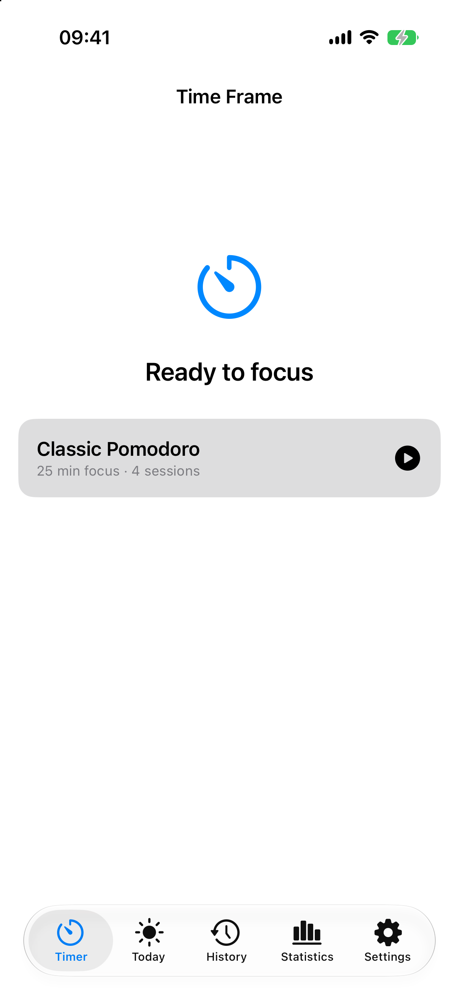
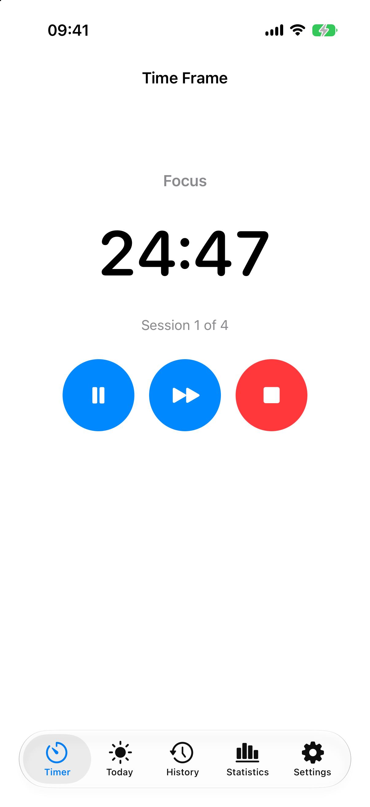
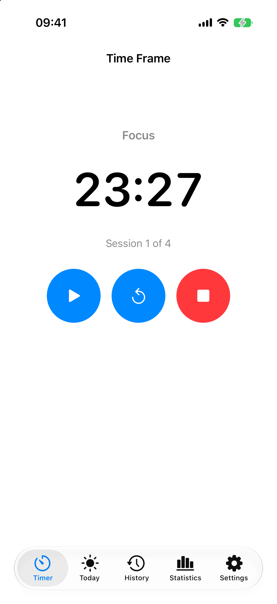
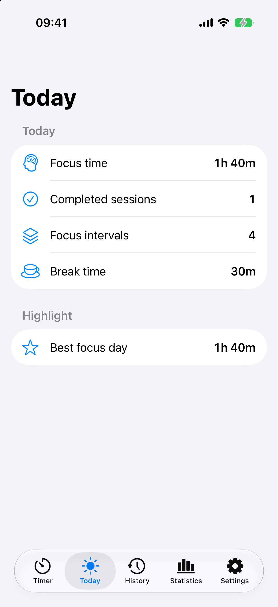
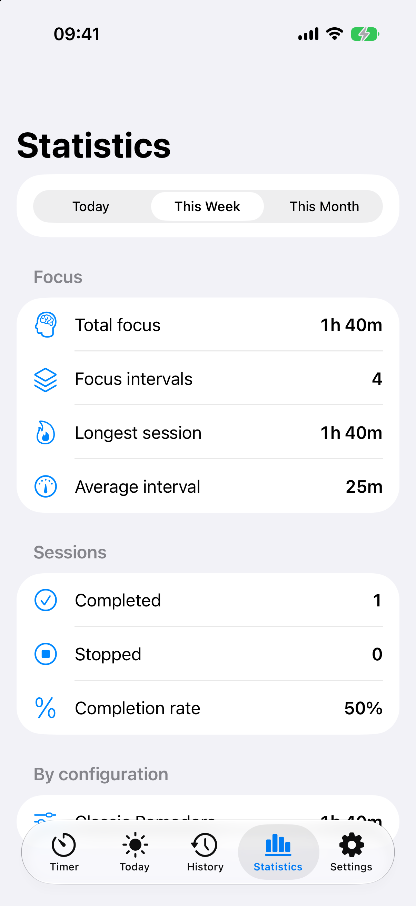
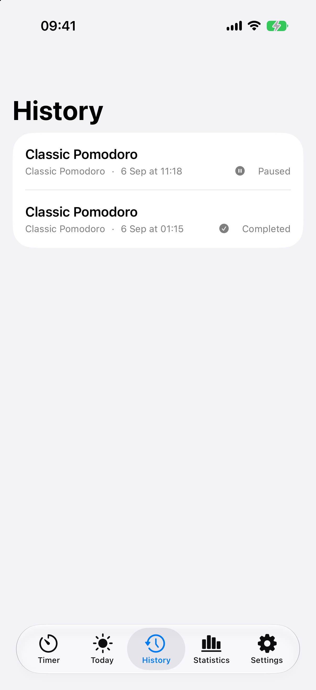
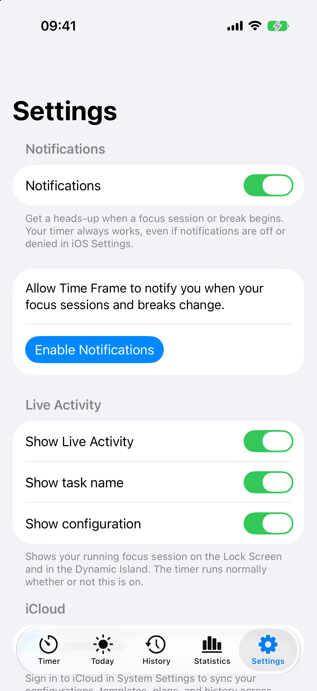
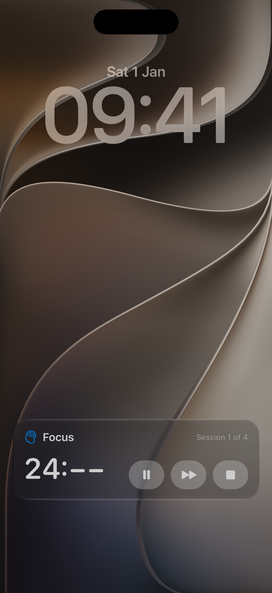
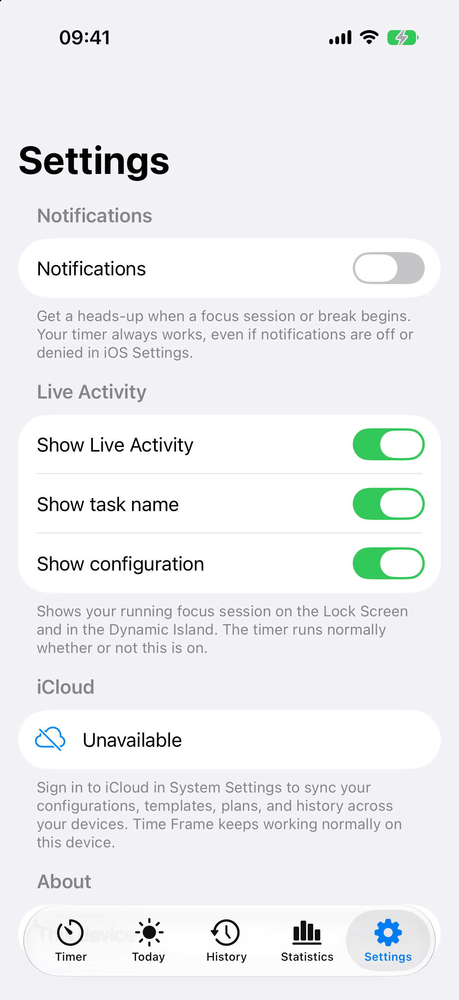

  
  <h1>Time Frame User Guide</h1>
  
Focus better, one session at a time.

---

> **Using a Mac?** There is a dedicated, more detailed
> [macOS User Guide](35-MACOS-USER-GUIDE.md) covering every Mac screen, the menu bar, keyboard
> shortcuts, Calendar, and which feature to use when. This guide covers all platforms and is
> illustrated with iPhone screenshots.

## Contents

1. [Welcome to Time Frame](#1-welcome-to-time-frame)
2. [What Time Frame does](#2-what-time-frame-does)
3. [Getting started](#3-getting-started)
4. [Understanding the timer](#4-understanding-the-timer)
5. [Timer configurations](#5-timer-configurations)
6. [Today](#6-today)
7. [Statistics](#7-statistics)
8. [History](#8-history)
9. [Notifications](#9-notifications)
10. [Widgets](#10-widgets)
11. [Control Center](#11-control-center)
12. [Live Activity](#12-live-activity)
13. [The macOS menu bar](#13-the-macos-menu-bar)
14. [Settings](#14-settings)
15. [Accessibility](#15-accessibility)
16. [App lifecycle](#16-app-lifecycle)
17. [Data and privacy](#17-data-and-privacy)
18. [Troubleshooting](#18-troubleshooting)
19. [FAQ](#19-faq)
20. [Platform availability](#20-platform-availability)
21. [Known limitations](#21-known-limitations)
22. [Support and feedback](#22-support-and-feedback)

---

## 1. Welcome to Time Frame

Time Frame is a focus timer for Mac, iPhone and iPad. You pick how long you want to concentrate, press
start, and Time Frame runs the session for you: focus, break, focus, break, until you are done. It
keeps a record of what you actually completed so you can look back on it later.

It is built around one idea: the timer should be trustworthy. It keeps time from real timestamps
rather than by counting ticks, so it stays correct if your Mac sleeps, your iPhone locks, or you quit
and reopen the app mid-session.

## 2. What Time Frame does

**Focus sessions.** A session is a sequence of intervals. A focus interval is time you spend working.
Between focus intervals, Time Frame gives you a short break; after several focus intervals, a longer
one. This is the Pomodoro pattern.

**Breaks.** Short and long breaks are part of the session, not an afterthought. Time Frame moves into
them automatically when a focus interval ends, and moves back out again when the break ends.

**History.** Every session you run is recorded, with the name of the configuration you used at the
time. Renaming or deleting a configuration later never rewrites your past sessions.

**Statistics.** Your completed intervals are summarised by day, week and month.

**Widgets, Control Center, Live Activities, notifications.** Time Frame surfaces the running session
across the system so you do not have to keep the app open to know where you are.

Everything you see outside the app is a read-only reflection of the one running timer, or a button
that sends a command back to it. Nothing runs a second, separate clock.

## 3. Getting started

### Launch Time Frame

On first launch, Time Frame creates one configuration for you, called **Classic Pomodoro**:
25 minutes of focus, four sessions.

*iPhone, Timer tab. The idle state shows the configuration Time Frame will run and a start button.*

### Start a session

Press the start button next to the configuration. The screen changes to show the running session.

*iPhone, Timer tab. A focus interval is running: the phase is "Focus", 24:50 remain, and this is
session 1 of 4. The three controls are Pause, Skip and Stop.*

### Pause and resume

Press **Pause**. The countdown freezes exactly where it is, and the controls change.

*iPhone, Timer tab. The session is paused. The controls are now Resume, Restart and Stop. No time
passes while you are paused.*

Press **Resume** to carry on from the same point.

### Skip

**Skip** ends the current interval early and moves straight to the next one. The interval you skipped
is still recorded — it is marked as skipped rather than completed, so it does not count toward your
focus totals.

### Restart

**Restart** (available while paused) puts the current interval back to its full length. The rest of
the session is untouched.

### Stop

**Stop** ends the whole session. What you already completed is kept in History; the interval you were
in is recorded as cancelled.

### Complete a session

When the last interval finishes, the session completes on its own. It moves to History and, if you
have notifications turned on, Time Frame tells you.

## 4. Understanding the timer

While a session is running you see four things:

| Element | Meaning |
|---|---|
| **Phase** | Whether you are in Focus, a short break, or a long break. |
| **Countdown** | Time remaining in the current interval. It is derived from the interval's real end time, not counted down tick by tick. |
| **Session position** | For example "Session 1 of 4" — which focus interval you are on, and how many the session has. |
| **Controls** | What you can do right now. The set changes with the state. |

Which controls appear depends on the state:

| State | iPhone and iPad | macOS |
|---|---|---|
| Running (focus) | Pause, Skip, Stop | Pause, Skip, Restart, Stop |
| Running (break) | Skip, Stop | Pause, Skip, Restart, Stop |
| Paused | Resume, Restart, Stop | Resume, Skip, Restart, Stop |

On iPhone and iPad, Pause is deliberately not offered during a break — a break is short and meant to
run out. Use Skip if you want to return to focus early.

## 5. Timer configurations

A configuration is a saved recipe for a session:

| Field | Meaning | Limits |
|---|---|---|
| Name | What you call it | Cannot be empty |
| Focus duration | Length of one focus interval | 1 second to 8 hours |
| Short break | Break between focus intervals | 0 to 8 hours |
| Long break | The longer break | 0 to 8 hours |
| Sessions before a long break | How many focus intervals before the long break | 1 to 12 |
| Focus sessions | How many focus intervals the session has | 1 to 24 |

**Configurations are created and edited on macOS.** Open the Configurations section in the sidebar to
add, rename, duplicate, edit or delete them, and to choose which one is the default.

**On iPhone and iPad you choose from your saved configurations, but you cannot create or edit them.**
The iOS app shows the configurations that exist and starts sessions from them.

Changing a configuration never changes a session that is already running, and never rewrites history.
When a session starts, it takes a frozen copy of the values it needs.

> Screenshots of the macOS Configurations screen are not included. See
> [Known limitations](#21-known-limitations).

## 6. Today

Today is a summary of the day so far.

*iPhone, Today tab. Focus time, completed sessions, focus intervals and break time for today, plus a
highlight comparing today with your best.*

Only intervals that ran to their planned end count here. An interval you skipped or a session you
stopped early does not add to your focus time.

## 7. Statistics

Statistics summarises your recorded history over a period you choose.

*iPhone, Statistics tab. The period picker offers Today, This Week and This Month. Below it: total
focus time, number of focus intervals, longest session, and average interval length.*

Statistics is derived from your history every time you look at it. Nothing is precomputed or cached,
so it always agrees with what History shows.

Sessions are attributed to the day they started. Individual intervals are attributed to the day they
finished. Configuration names are the frozen ones recorded with each session, so renaming or deleting
a configuration does not change past numbers.

## 8. History

History lists your recorded sessions, newest first.

*iPhone, History tab. Each row shows the task or configuration name, when the session started, and
how it ended — here, one paused session and one completed session.*

A session appears in History as soon as it starts, and its status updates as it progresses. Stopping
a session never deletes it.

## 9. Notifications

Time Frame can tell you when a focus interval or break begins and when a session finishes.

### Turning notifications on

Notifications are off until you ask for them. Open Settings and turn on **Notifications**.

*iPhone, Settings. Before iOS has been asked, Time Frame explains what it wants and offers an
"Enable Notifications" button. Tapping it presents the standard system permission prompt.*

### What you can be notified about

Once authorised, you can choose individually:

- Focus sessions start
- Short breaks start
- Long breaks start
- Session completes

And two style options:

- **Sound** — whether notifications make a sound.
- **Action buttons** — whether the notification carries Pause and Skip buttons you can use without
  opening the app.

### If you decline

**Your timer always works, whether or not notifications are allowed.** If you decline the system
prompt, Time Frame tells you notifications are off and offers to open system settings. It never
blocks, retries, or degrades the timer.

Notifications are scheduled from the interval boundaries the timer already knows about, so you get one
notification per boundary — never a stream of updates.

## 10. Widgets

### Home Screen widgets

Time Frame offers Home Screen widgets in small, medium and large sizes, on macOS, iPhone and iPad.
Each widget can be configured — press and hold it, choose Edit Widget — to show one of three things:

| Mode | Shows |
|---|---|
| **Timer** | The running session: phase, countdown, and session position |
| **Today** | Today's focus time and completed sessions |
| **Statistics** | A focus glance with a trend against the previous day |

You also choose where tapping the widget takes you (Timer, Today, Statistics or History), and whether
the countdown is displayed.

In **Timer** mode the widget also carries controls — Pause, Resume, Skip, Restart, Stop or Start,
depending on what the session is doing. Pressing one acts on the real session. Today and Statistics
modes are read-only.

### Lock Screen widgets

On iPhone and iPad, Time Frame provides three Lock Screen accessory widgets:

| Family | Shows |
|---|---|
| **Circular** | A compact progress ring with the remaining time |
| **Rectangular** | Phase, countdown and session position |
| **Inline** | A single line of text beside the Lock Screen clock |

Lock Screen accessories are read-only. Tapping one opens Time Frame at the screen you configured.

### StandBy

StandBy is served by the existing small and medium Home Screen widgets. There is no separate StandBy
widget to add — if you have a Time Frame Home Screen widget, it appears in StandBy.

### macOS widgets

The macOS widget offers the same small and medium sizes and the same three modes as iOS.

> Widget screenshots are not included in this guide. In the local unsigned build used for capture,
> widgets render only their placeholder because the shared App Group is unavailable without a signed
> entitlement. See [Known limitations](#21-known-limitations).

## 11. Control Center

On iPhone and iPad, Time Frame adds four controls you can place in Control Center:

| Control | Behaviour |
|---|---|
| **Time Frame** (adaptive) | Does the sensible thing for the current state: Start when idle, Pause while running, Resume while paused, Skip where appropriate |
| **Start** | Starts a session from your default configuration |
| **Stop** | Stops the running session |
| **Quick Start** (configurable) | Starts a session from a specific saved timer that you choose |

To choose which timer Quick Start uses, press and hold the control while editing Control Center and
pick one of your saved configurations. If you later rename that configuration, the control follows the
rename; if you delete it, the control fails safely instead of starting a phantom session. If you do
not choose one, it starts your default configuration.

Control Center controls are iPhone and iPad only. They are not available on macOS.

> Control Center screenshots are not included; the controls require a provisioned build to appear in
> the Control Center gallery.

## 12. Live Activity

When you start a session on iPhone, Time Frame can show a Live Activity — a live card on the Lock
Screen and in the Dynamic Island.

*iPhone Lock Screen. The Live Activity shows the phase ("Focus"), the session position ("Session 1 of
4"), the countdown, and three controls: Pause, Skip and Stop. Pressing one acts on the real session.*

The Live Activity appears when a session starts and disappears when it ends. You can turn it off, and
choose whether it shows your task name and configuration, in Settings.

**The timer runs normally whether or not the Live Activity is on.** It is a display of the session,
not the session itself.

**Live Activities are iPhone and iPad only.** They are not available on macOS: Apple's ActivityKit
framework is not offered to native Mac applications.

Verification note: the Lock Screen Live Activity above was captured on a simulator. The Dynamic Island
presentation was observed on the simulator but not captured. Behaviour on physical hardware —
including the expanded Dynamic Island — has not been verified.

## 13. The macOS menu bar

On macOS, Time Frame can live in the menu bar. The status item shows the current phase and, if you
want, a live countdown; clicking it opens a small panel with the session and its controls.

Closing the main window does not stop your session. As long as Time Frame is in the menu bar, the app
and its timer keep running.

You can turn the menu bar item off, and turn the countdown off separately, in Settings.

## 14. Settings

### iPhone and iPad

*iPhone, Settings tab.*

| Setting | What it does |
|---|---|
| **Notifications** | Master switch. When on and authorised, reveals which events to notify about and the sound and action-button options. |
| **Show Live Activity** | Whether a running session appears on the Lock Screen and Dynamic Island. |
| **Show task name** | Whether the Live Activity includes your task name. |
| **Show configuration** | Whether the Live Activity includes the configuration name. |
| **iCloud** | Status only. See [Data and privacy](#17-data-and-privacy). |
| **About** | A short, non-identifying id for this installation. |

### macOS

| Section | Settings |
|---|---|
| **Default Configuration** | Which configuration new sessions start from. |
| **Calendar** | Whether sessions are mirrored to a calendar, which calendar, and when events are created. |
| **Notifications** | The same options as iOS: which events, sound, action buttons. |
| **Menu Bar** | Show Time Frame in the menu bar; show the countdown in the menu bar. |
| **iCloud** | Status only. |
| **Keyboard Shortcuts** | Reference list of the app's shortcuts. |
| **About** | Application name and version. |

## 15. Accessibility

Time Frame is built with VoiceOver and Dynamic Type in mind.

- **VoiceOver.** The countdown, phase, controls and progress carry explicit labels and values. The
  countdown is marked as frequently updating, so VoiceOver does not interrupt you every second.
  Statistics and Today figures are grouped so each reads as one item rather than a scatter of numbers.
- **Dynamic Type.** Layouts use text styles rather than fixed sizes, and the timer screen scrolls
  rather than clipping at the largest accessibility sizes.
- **State is never colour alone.** Paused, running and each phase are always carried by a label or an
  icon as well as colour.
- **Reduced Motion.** Animations go through a Reduce Motion-aware path.

Verification note: this is verified from the source and by automated accessibility-text tests. It has
**not** been validated with VoiceOver on a physical device.

## 16. App lifecycle

**The timer keeps correct time from timestamps, not from a running counter.** This is what makes the
following behaviours work.

| What happens | What Time Frame does |
|---|---|
| App goes to the background | The session continues. Nothing is paused. |
| App returns to the foreground | The timer reconciles against the real clock and shows the true remaining time. |
| Mac sleeps and wakes | The session reconciles immediately on wake, catching up through any intervals that ended while asleep. |
| Device is locked | The session continues; the Live Activity and Lock Screen widgets keep showing it. |
| App is quit and relaunched while a session was running | Time Frame restores the session, fast-forwards through any intervals whose end passed while it was closed, and carries on if it is still unfinished. |
| A session cannot be safely restored | It is marked interrupted and kept in History, and Time Frame shows a calm notice rather than losing it. |

A running session is restored only on the device it was started on. A session running on another
device is never picked up and continued here.

## 17. Data and privacy

**What Time Frame stores.** Your configurations, task templates, session plans, and the history of
sessions and their intervals. All of it is stored locally on your device.

**Where it is stored.** In the app's own database on the device. There is no Time Frame account, no
analytics, no tracking, and no network service that your focus data is sent to.

**App Group.** Widgets and Control Center controls cannot read the app's database directly. Instead
the app writes a small summary — the current phase, the interval's start and end times, today's
totals — into a shared container that those surfaces read. It contains no personal content beyond
your task and configuration names.

**Notifications.** Scheduled locally on your device through the system notification service. Nothing
is sent to a server.

**iCloud.** **iCloud sync is currently disabled.** The app is built with a personal Apple developer
team, which cannot provision the iCloud capability, so the iCloud entitlement is deliberately not
present and no cloud container is used. Settings reports iCloud as unavailable, and Time Frame works
fully as a local application. Cross-device sync has never been enabled or verified.

## 18. Troubleshooting

**The timer looks stuck, or the app is unresponsive.**
Quit and reopen Time Frame. Your session is restored from its recorded timeline; you will not lose it.
If the app becomes unresponsive as soon as a session starts, make sure you are running a current
build — a defect with exactly that symptom was identified and fixed.

**I am not getting notifications.**
Check three things in order. First, Settings in Time Frame: is **Notifications** on, and is the
specific event you expect enabled? Second, whether you granted permission when asked — if you
declined, Time Frame shows a notice and can open system settings for you. Third, whether a Focus mode
is filtering them. Time Frame's notifications are ordinary notifications and respect Do Not Disturb.

**A widget is not updating.**
Widgets refresh when the session meaningfully changes, not every second, so a small delay is normal.
If it never updates, the most common cause is that the app has not run since you added the widget —
open Time Frame once. If it shows only a grey skeleton, the shared App Group is unavailable, which
happens with an unsigned local build.

**A Control Center control is missing.**
Control Center controls are iPhone and iPad only, on iOS 18 and later. Add them by editing Control
Center and choosing Time Frame. They do not appear in a build without proper signing.

**Quick Start does nothing.**
The configuration it points to has probably been deleted. Edit the control and choose an existing
timer, or leave it unset to use your default configuration.

**A configuration disappeared.**
Configurations are only removed when you delete them. Deleting one never deletes the sessions you ran
with it — those keep the name they had at the time, and still appear in History and Statistics.

**The app restarted in the middle of a session.**
Reopen it. If the session can be safely restored it resumes, fast-forwarded to the correct point. If
it cannot, it is marked interrupted, kept in History, and Time Frame explains what happened.

**iCloud says unavailable.**
That is expected. See [Data and privacy](#17-data-and-privacy).

## 19. FAQ

**Does the timer keep running if I close the app?**
On macOS, yes, as long as Time Frame is in the menu bar. If you quit it entirely, the session is
restored and fast-forwarded the next time you open it. On iPhone, the session continues while the app
is backgrounded and is reconciled when you return.

**Does pausing lose my progress?**
No. Pausing freezes the interval exactly where it is. No time passes while paused.

**What is the difference between Skip and Stop?**
Skip ends the current interval and moves to the next one; the session continues. Stop ends the whole
session.

**Do skipped intervals count toward my focus time?**
No. Only intervals that ran to their planned end count.

**Can I create configurations on my iPhone?**
Not currently. Configurations are created and edited on macOS.

**If I rename a configuration, do my old sessions change?**
No. Each session keeps the configuration name it had when it ran.

**Do widgets or Control Center run their own timer?**
No. They display the one running session, or send a command to it.

**Can I use Time Frame with Siri or Shortcuts?**
Yes. Time Frame provides App Intents for starting, pausing, resuming, skipping, restarting and
stopping a session, for starting from a template or plan, and for asking about the current session.

**Does Time Frame work offline?**
Entirely. There is no network dependency.

**Is my data synced between my Mac and iPhone?**
No. See [Data and privacy](#17-data-and-privacy).

## 20. Platform availability

| Platform | Requirement | Notes |
|---|---|---|
| macOS | macOS 27 | Full application: timer, configurations, templates, plans, history, statistics, calendar, menu bar, widgets |
| iOS | iOS 26 | Timer, Today, History, Statistics, Settings; widgets, Lock Screen accessories, Control Center, Live Activities, notifications |
| iPadOS | iOS 26 | Same as iPhone |

Feature availability by platform:

| Feature | macOS | iPhone / iPad |
|---|---|---|
| Focus timer | Yes | Yes |
| Create and edit configurations | Yes | No |
| Task templates and session plans | Yes | No |
| Today, History, Statistics | Yes | Yes |
| Notifications | Yes | Yes |
| Home Screen widgets | Yes | Yes |
| Lock Screen accessory widgets | No | Yes |
| StandBy | No | Yes |
| Control Center controls | No | Yes |
| Live Activity and Dynamic Island | No | Yes |
| Menu bar item | Yes | No |
| Calendar integration | Yes | No |
| iCloud sync | Disabled | Disabled |

## 21. Known limitations

- **iCloud sync is disabled** and cross-device sync has never been verified.
- **Configurations, templates and plans cannot be created or edited on iPhone or iPad.**
- **Live Activities are not available on macOS**, because Apple does not offer ActivityKit to native
  Mac applications.
- **Control Center controls are not available on macOS.**
- **Physical-device behaviour is unverified.** Notification banners, StandBy, the Dynamic Island,
  and VoiceOver have not been validated on real hardware.
- **No macOS screenshots** appear in this guide; see the
  [screenshot inventory](assets/screenshots/README.md) for the reason.
- **Widget and Control Center screenshots** could not be produced from an unsigned local build.

## 22. Support and feedback

Time Frame does not currently have a public support channel, issue tracker, or feedback address. No
support contact is published because none exists yet.

If you are working from the source repository, the documents under [`docs/`](README.md) are the
reference material, and [`docs/DECISIONS.md`](DECISIONS.md) records why the application is built the
way it is.
